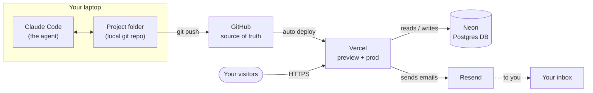

import LeadMagnet from '../../components/LeadMagnet.astro';

## Context

This piece picks up where *[The Solo Founder's New Baseline](/en/builders/solo-founder-new-baseline)* left off. You have decided the coding-agent path is the right one for what you are building. The question now is operational: what do you actually install, what connects to what, and what do you need to understand to command the stack with confidence.

The answer, as of April 2026, is a small number of pieces that fit together cleanly, come with generous free tiers, and do not lock you in. You can run this stack for months before you pay anything beyond the Claude Code subscription. Everything in it is mainstream, well-documented, and agent-friendly — your coding agent will already know how to set up every component.

Everything below assumes a Mac or a Linux laptop. Windows works but the terminal experience is rougher; get a Mac if you can.

---

## The stack

**Claude Code.** The coding agent. Runs in your terminal, sees your project folder, asks for confirmation before it writes anything destructive. Start with the Pro plan and move to Max when you find yourself throttled by usage limits. I personally run Max for enough tokens to burn through without rationing.

**GitHub.** The source of truth for your code. Every change your agent makes gets versioned here. If anything goes wrong, you can roll back. If you want a second pair of eyes later — human or AI — they read from here. GitLab works identically; pick GitHub unless you have a reason not to.

**Vercel.** The platform that hosts your site and exposes it to the public internet. Connects directly to your GitHub repository: every push to your main branch deploys to production automatically, and every push to another branch gives you a preview URL you can share before you commit to shipping. Vercel also handles your custom domain, your analytics, your serverless functions, and integrates with database and email providers out of the box. The free tier is enough to get you running. The paid tier is cheap relative to what you would pay to run the equivalent yourself.

**Neon.** The database. Serverless Postgres with a free tier, a pleasant UI, and fast provisioning. You do not need a database on day one — a content site or a lead-capture page can be database-free — but when you do, Neon is the right default. I recommend it specifically because it is pure Postgres: if you ever leave, your data exports cleanly and moves to any Postgres host. No migration tax.

**Resend.** The email layer. When someone fills in your contact form or subscribes to a lead magnet, Resend is what sends the email. It is what this site runs on. Cheap, excellent developer experience, and your agent will wire it up in minutes.

**Linear.** Optional. For solo operators, Linear is overkill until you are juggling five workstreams at once. If you are genuinely multi-threaded, start using it. Otherwise skip it — you do not need ceremony.

---

## The architecture

Here is how the pieces connect and what actually flows between them.

Three loops.

The **development loop** lives on your laptop. You talk to Claude Code. It edits files in the project folder. You review, accept, and commit. When a change is ready to share, you push to GitHub.

The **deployment loop** is automated. Vercel watches GitHub. Every push to your main branch triggers a production deploy. Every push to any other branch gives you a preview URL. You never touch the deployment machinery.

The **user loop** is whatever the product does. A visitor hits your site on Vercel. The code you wrote (with the agent) runs. It reads from or writes to Neon when it needs data. It triggers Resend when it needs to send mail. You find out about reactions and subscriptions in your inbox.

Nothing magical. Nothing proprietary. Every piece is replaceable.

---

## Neon vs Supabase — choose cleanly

If you have researched databases at all in 2025 or 2026, you have seen Supabase suggested everywhere. It is a strong product. It is also the common shortcut that becomes the common regret.

| Dimension | Neon | Supabase |
|---|---|---|
| Core | Serverless Postgres — just the database | Postgres + auth + storage + realtime bundled |
| Auth | Not included — you add it when you need it | Built-in, tempting to use |
| Storage | Not included | Built-in |
| Vendor lock-in risk | Low — pure Postgres, exports cleanly | Higher — auth and storage tie you to Supabase APIs |
| Best for | Operators keeping their escape hatches open | Operators optimising for day-one completeness |

The trap is the auth. Supabase auth looks wonderful on day one — it is. But it stores user credentials and session state in Supabase-specific structures, and if you want to move away later, you are migrating a live user base. You will need to force password resets, re-onboard users, or build a painful dual-write window. I have seen this path from the inside more than once.

Neon keeps you in pure Postgres. When you need authentication later, you layer it in with a dedicated service (Clerk, WorkOS, Better Auth, Auth.js — the market has strong options). You keep the escape hatch the whole way.

My recommendation: **start with Neon, skip authentication until you actually need it, and when you do, do not bolt it onto the database.** This keeps the stack honest and the exits open.

---

## The minimum jargon to own

You do not need to learn to write code. You do need to understand the vocabulary your agent will use when it talks to you. This is the list. Do not pretend to know these — learn them once.

- **git** — the version control system. Tracks every change.
- **repo (repository)** — the folder, versioned. Lives both on your laptop and on GitHub.
- **commit** — a saved checkpoint of changes with a message describing what changed.
- **branch** — a parallel line of work. `main` is the production line. You create a branch for each new feature or fix.
- **merge** — combining a branch back into `main` when the work is ready.
- **pull request (PR)** — a proposal to merge a branch, with a diff you can review before accepting.
- **deploy** — publishing the current state of the code to a running environment.
- **environment** — where the code is running. Typically: local (on your laptop), preview (each branch on Vercel), production (your real site).
- **rollback** — reverting to a previous commit or deployment. The safety net when something breaks.

Twenty minutes with the agent, and you will understand all of these in practice. It is not optional. It is the operating vocabulary.

---

## Day one — seven steps

Do these in order, with the agent guiding you through each.

1. **Install Claude Code.** Follow the Claude Code docs on your Mac. Start it by opening a terminal and typing `claude` in the folder where your project will live.
2. **Create a GitHub account** (if you do not have one) and create an empty repository for your project. Ask Claude Code to connect your local folder to it — it will walk you through the exact commands.
3. **Create a Vercel account** and connect it to your GitHub account. Import the empty repository. You now have a live URL that does nothing yet — that is fine.
4. **Decide what you are building first.** One small thing. A landing page. A site. Not an app. Describe it to Claude Code and let it scaffold the framework. For content sites, Astro is a pleasant default; for interactive apps, Next.js.
5. **Push to GitHub, watch Vercel deploy.** The feedback loop is now closed. Every change you and the agent make goes live in under a minute.
6. **Add Resend when you need a form.** When the first lead capture or contact form appears, create a Resend account, generate an API key, let the agent wire it into a server function. Less than an hour of work.
7. **Add Neon when you need state.** When you have something to store — subscribers, sessions, content that users create — create a Neon project, let the agent connect it, and start small. A single table is fine.

That is the sequence. Do not jump ahead. The sequencing is the leverage.

---

## Claude Code essentials

A handful of features are worth learning on day one. Each one is a slash-command inside Claude Code.

- **Model selection.** Sonnet for speed, Opus for depth. Use Sonnet by default for routine work. Switch to Opus when the task is architectural or you want higher judgment per token.
- **Effort levels.** `Medium` handles most work. `High` burns faster but reasons longer — worth it for genuinely tricky problems. Do not use `high` as your default.
- **Plan mode.** Before the agent executes any significant change, ask it to plan first. You see what it intends to do. You confirm. Then it executes. For non-technical operators this is the single most important habit — you review judgment before you pay in tokens and code.
- **Skills.** Reusable instructions the agent loads on trigger. You can write your own — or let the agent help you write them — so that recurring workflows become one-line invocations.
- **Hooks.** Automated actions the harness runs on specific events (before a commit, after a task completes). Used well, hooks enforce the habits you want without requiring you to remember them.

Two deeper pieces on why this matters: *[Context is the Edge](/en/archive/s3-p2-context-is-the-edge)* — on why your project context is the thing that compounds across every session — and the CTO piece linked earlier, which argues why operator judgment cannot be outsourced even in an AI-augmented world.

Put everything you learn — conventions, skills, hooks, project instructions — inside the project folder itself, in a `.claude/` subdirectory. That way it is version-controlled, portable across machines, and inherited by any new session the agent starts.

---

## My personal stack, in one breath

- **Agent.** Claude Code, Max plan.
- **Version control.** GitHub.
- **Deployment.** Vercel.
- **Database.** Neon (when needed).
- **Email capture + transactional mail.** Resend.
- **Analytics.** Vercel Analytics + Speed Insights.
- **Project management.** Linear (only on active engagements — skip for solo work).
- **Editor.** Claude Code in terminal. That is it.
- **OS.** macOS.

This is the stack that runs this site, and the stack I recommend when I sit down with an operator who is starting today.

---

## Closing Note

The stack is simple. The leverage is not in the components — it is in how cleanly they fit together and how little they lock you in. That is the difference between infrastructure that compounds with you and infrastructure that you eventually pay to escape.

Day-one overwhelm is real. Do not read this piece and try to set all of it up before Friday. Claude Code, GitHub, Vercel — that is the first session. A deploy that works, a URL you can share, a repo you can roll back. Everything else joins later, as the need appears, one piece at a time.

The agent will teach you the rest.

<LeadMagnet
  assetSlug="ai-native-builder-starter-prompt"
  lang="en"
  articleTitle="The Operator's AI Stack: April 2026"
  articleUrl="https://boringsystems.app/en/builders/operator-ai-stack-april-2026"
/>
