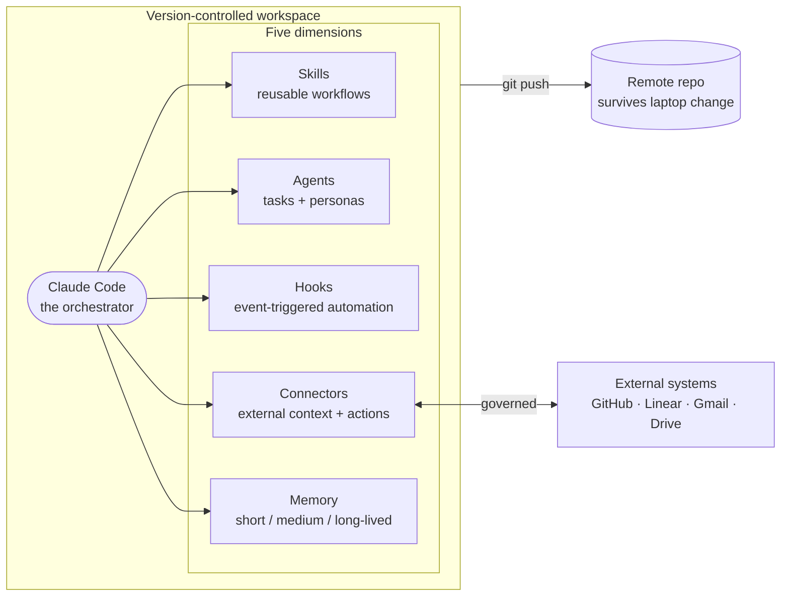

import LeadMagnet from '@/components/LeadMagnet.astro';

## Context

This is the practical companion to *[The Harness Behind the Agent](/en/writing/harness-behind-the-agent)*. That piece argues why the harness is where operator leverage compounds. This one shows what mine actually looks like — the file tree, the diagram, the real names of skills and personas I use, and the order I would build it in if I were starting again from zero.

Nothing here is theoretical. Every artifact in this piece is in the repo that ships this site. You are reading its output right now.

---

## The orchestrator model

The simplest way to see a harness is as an orchestrator. The model is the brain. Everything else is a dimension the brain can reach for when it needs to.



One brain. Five dimensions. One substrate — git — that holds all of it and lets the whole thing survive a fresh machine. That is the whole architecture.

---

## The workspace file tree

I keep one parent project that contains everything else as sub-projects or submodules. That gives me one `cd` to start, one repo to clone, and clean project-level boundaries for anything I want to scope tightly.

Shape:

```
Workspace/
├── CLAUDE.md                         ← workspace-level instructions
├── WORKSPACE_MAP.md                  ← "where is what", read first
├── .claude/
│   ├── settings.json                 ← permissions + hooks + MCP config
│   ├── setup.sh                      ← one-line fresh-machine bootstrap
│   ├── hooks/                        ← event-triggered scripts
│   │   ├── session-start.sh
│   │   ├── block-protected-push.sh
│   │   └── auto-commit.sh
│   ├── git-hooks/
│   │   └── pre-push                  ← workspace npm audit gate
│   ├── agents/                       ← my three personas
│   │   ├── gtm-strategist.md
│   │   ├── principal-engineer.md
│   │   └── career-coach.md
│   ├── personal-skills/              ← workspace-wide skills
│   │   ├── commit/
│   │   ├── log-decision/
│   │   ├── wrap-session/
│   │   └── …
│   └── decisions/DECISIONS.md        ← append-only decision log
├── memory/
│   ├── MEMORY.md                     ← auto-loaded index
│   └── feedback_*.md                 ← operational memory files
├── llm-context-2026/                 ← long-lived strategic context
│   ├── inner-game/                   ← identity, work hygiene
│   ├── market/                       ← positioning, GTM doctrine
│   └── transition/                   ← phase-specific context
├── boringsystems/                    ← this site, as a submodule
│   ├── CLAUDE.md                     ← project-level instructions
│   └── .claude/skills/               ← project-level skills
└── <other sub-projects>/
```

Two properties of this layout are doing real work. **One**: every dimension has its own folder. Skills are not next to hooks, memory is not next to decisions. You can find what you need without searching. **Two**: project-specific things live inside their project, not at the workspace root. A skill that only makes sense for this site lives under `boringsystems/.claude/skills/`, not under the shared `.claude/personal-skills/`. That keeps the shared layer clean.

---

## Dimension 1 — Skills

I have roughly a dozen skills of my own, plus platform-provided ones that come with Claude Code itself. The ones I reach for most:

- **`/commit`** — stages, writes a meaningful message, pushes to the current feature branch. Never to `main`. Closes the "I want to checkpoint" loop.
- **`/log-decision`** — appends to `DECISIONS.md` with a date, context, decision, and consequences. Auto-invoked after any architectural change I want to be able to retrieve later.
- **`/wrap-session`** — fires when a PR has merged. Syncs main, deletes the feature branch, proposes improvements to the harness based on what came up during the session. This is the loop, codified.
- **`/article-review`** — project-scoped to this site. Loads my design charter, my target-audiences doc, my French guide, and flags voice / structure / lane issues before publishing.

What makes a skill earn its place: a workflow I do at least weekly, with enough repeatable structure that the skill definition is shorter than re-typing the instructions would be. If I wrote it once and never used it, that is a signal to cut, not to keep.

A skill file is short. A title, a description, a trigger, a checklist, and an example. Nothing fancy.

---

## Dimension 2 — Personas

I run three personas. Each is a sub-agent with a sharp point of view, a tool budget, a pre-loaded set of documents to read before answering, and a short list of situations that are worth invoking them for.

- **Naomi Renard — `gtm-strategist`.** Senior GTM mind, European-market grounding, distribution craft. Reads my positioning docs and my go-to-market folder before responding. I invoke her when I need to stress-test a pitch, shape a narrative, rebrand past work, or decide whether an inbound is worth the time.
- **Daniel Kovac — `principal-engineer`.** Twenty-five years across the stack, pragmatic-purist, skeptical of hype. Reads my architecture boundary docs before responding. I invoke him for architecture decisions, code review, stack choices, and when I need someone to tell me honestly whether the shortcut is a shortcut or a trap.
- **Hadi Bensoussan — `career-coach`.** Depth psychology grounding, technologist-mentor. Reads my identity and work-hygiene documents. I invoke him when I notice I am avoiding something, when a decision carries more emotional weight than it should, or when I need to structure tangled thinking before a real move.

Each persona file follows the same structure: *who they are, tools they can use, documents to pre-load, constraints that shape their answers, and a set of named situations to invoke them for.* Writing a persona is not mystical. It is a prompt with discipline.

**Building your own persona** is three passes. First pass: the voice — who is this person, what is their background, what is their register, what do they absolutely never say. Second pass: the pre-load — which files do they read before answering anything, so their answers are grounded in your situation and not generic. Third pass: the invocation list — which specific situations are worth pulling them in for. Keep that list short. A persona you invoke for everything stops being a persona.

---

## Dimension 3 — Hooks

Hooks are the harness being opinionated without me having to remember to be. The ones that earn their keep on my workspace:

- **`SessionStart`** — loads the right context files when a session begins. Project-aware: the workspace session loads different context than a session inside this site.
- **`PreToolUse` — block-protected-push.** Intercepts any git push that targets `main`, `master`, `dev`, `development`, or `production` and blocks it. I cannot accidentally push to a protected branch. The hook returns a clear "use a feature branch" message.
- **`Stop` — auto-commit.** When a session ends with uncommitted changes on a feature branch, the hook commits them with a checkpoint message and pushes. Work that was in-progress never dies in a closed terminal window.
- **`pre-push` (git-level) — npm audit gate.** Before any push leaves my machine, a workspace-level script runs `npm audit --audit-level=high` across every sub-project. If any has an unresolved high or critical finding, the push is blocked. Security discipline without ceremony.

Two principles on hooks. First — **hooks enforce, they do not remind.** A hook that says "hey, you might want to do X" is worse than no hook at all, because you stop reading it. A hook either acts or it gets out of the way. Second — **hooks live in the repo**. A hook that only works on my laptop, because I configured it once and forgot, is a hook that will fail silently when I change machines. Every hook in my harness is checked in.

---

## Dimension 4 — Connectors

I am strict about one rule here: **connectors go through the platform, never through tokens on disk.**

What this means concretely: GitHub, Linear, Gmail, Google Calendar, Google Drive, Notion all connect through the claude.ai connector system. No personal access tokens in config files. No API keys that travel with me between machines. The agent asks for a one-time auth, the platform holds the session, and when I switch laptops the connection re-authorizes without touching my dotfiles.

The governance piece sits on top. For each connector, I decide which verbs are allowed without confirmation. Read operations are generally fine. Write operations — sending an email, creating a Linear issue with a due date that will page someone, modifying a calendar — require me to explicitly approve each time. Read-mostly / write-with-confirmation is the sensible default, and it is what I run.

The other connector I use is the one to this repo itself — a GitHub integration that lets the agent open branches on my behalf but never lets it open PRs. I push; I open the PR myself. Small division of labor that keeps the handoff clean and gives me a natural checkpoint where I actually read the diff.

---

## Dimension 5 — Memory

Three time-horizons, three files-on-disk shapes.

**Short-lived — sessions.** Tasks, plans, in-progress state. Lives in the agent's own session memory. Evaporates when I close the window. Fine.

**Medium-lived — operational memory.** A folder of small markdown files, one topic per file. Each file captures a pattern I want to persist across sessions:

- a rule the agent must follow (`feedback_collaboration.md`)
- a project reality that evolves weekly (`project_boringsystems_lead_magnet.md`)
- a user profile that shapes every session (`user_profile.md`)
- a pointer to external context (`reference_linear_boards.md`)

All of them are indexed in a `MEMORY.md` file at the top of the folder. That index is auto-loaded at session start. Individual files are loaded on demand when the topic comes up. Cheap, bounded, searchable.

**Long-lived — strategic context.** A separate folder (`llm-context-2026/` in my case) that holds identity documents, positioning doctrine, market lens, transition plans. This changes slowly — weeks to months between meaningful edits — and is load-bearing for any strategic decision the agent helps me with. I never merge these into medium-lived memory. Mixing the two is how strategic context gets diluted by day-to-day noise.

The operating theory behind the three-layer split, and why git underneath it is non-negotiable, is in *[Context is the Edge](/en/archive/s3-p2-context-is-the-edge)*.

---

## The time-horizon matrix

Splitting by time-horizon is the move that keeps cognitive load under control. Every dimension has its three levels. Roughly:

|  | Short-lived | Medium-lived | Long-lived |
|---|---|---|---|
| **Skills** | Ad-hoc prompts in-session | Project-scoped skills | Workspace-wide skills |
| **Agents** | A delegated sub-task | A persona I invoke weekly | A persona shaping months of work |
| **Hooks** | A one-shot pre-check | Session & commit-level hooks | Git-level + setup hooks |
| **Connectors** | A one-time read | Weekly-touched integrations | Always-on context feeds |
| **Memory** | Session state | Operational feedback memory | Strategic context archive |

The matrix is not a checklist. It is a diagnostic — when something feels chaotic, I ask *which cell does this belong in, and am I storing it in the right one?* Half the time the answer is that I let a short-lived thing leak into long-lived memory, or vice versa, and cleaning that up removes the friction.

---

## The loop

Every dimension improves the same way.

1. The agent does something I didn't want, or fails to do something I needed.
2. I decide whether this was a one-off or a pattern.
3. If it's a pattern, I pick the dimension that fits: a hook to block it, a skill to standardize it, a feedback memory to teach it, or a persona adjustment so the right lens catches it next time.
4. I write the change into the repo, commit, push.
5. Next session inherits the lesson.

**Twice is a pattern.** If the same manual correction happens twice in a session, I stop, diagnose, and codify before the third time. That rule alone is responsible for most of the compounding the harness delivers.

The other half of the loop is pruning. Every so often I read the harness as a stranger would, skill by skill, hook by hook, memory file by memory file — and ask *would I add this today?* If not, I cut.

---

## Where to start, if you're starting today

One mistake operators make when they see a harness like this is to try to scaffold the whole thing upfront. Don't. The sequencing matters more than the completeness.

1. **Make the workspace a git repo.** One parent project. Everything lives inside. This is the substrate — without it, nothing else compounds.
2. **Add a `CLAUDE.md` at the root.** One page. Who you are, how you want the agent to work with you, the non-negotiables.
3. **Write one skill.** The workflow you repeat most — probably committing, probably something else. Make it a slash command.
4. **Add one hook.** The one that protects you from your own worst mistake. For most people, blocking pushes to `main` is the right first hook.
5. **Add one memory file.** The one correction you give the agent most often. Write it down in a `feedback_*.md` file. Index it in `MEMORY.md`.
6. **Add one persona.** The lens you wish you had a trusted human for. Keep the file short, pre-load their context, define when to invoke them.
7. **Wire one connector.** The external system that holds context the agent most often needs. Start read-only.

That is a weekend's worth of work. After that, you grow it from the loop — from mistakes and patterns, not from a plan. Let the harness tell you what it needs.

---

## Closing note

The five dimensions are a map. The substrate is what makes the map real. The loop is what makes the map improve. That is the whole thing.

I run this for my own work every day. It is not a demo and it is not complete — it is a living system that has grown from about ten weeks of running it seriously. The version I run in October will not look like this one. That is the point.

If you want the doctrine version of this piece — the *why*, the counter-positions, the platformization window — that is *[The Harness Behind the Agent](/en/writing/harness-behind-the-agent)*.

If you already have a harness running and want a second pair of eyes on it, that is the lead magnet below — I'll send you back a written audit and a set of prompts your coding agent can run to level it up. If you are starting from zero and want the full stack scaffolding prompt — the one that sets up git, GitHub, Vercel, Neon, Resend, and the initial project conventions — the *[AI-Native Builder Starter Prompt](/en/writing/solo-founder-new-baseline)* is the better entry.

Pick the one that matches where you are. The harness is yours to build either way.

<LeadMagnet
  assetSlug="harness-audit"
  lang="en"
  articleTitle="The Harness I Actually Run"
  articleUrl="https://boringsystems.app/en/building/the-harness-i-actually-run"
/>
