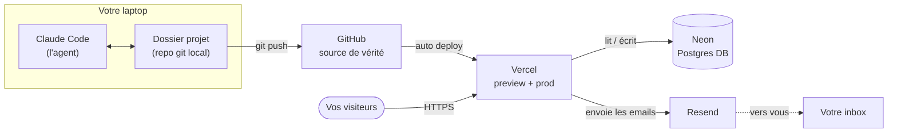

import LeadMagnet from '../../components/LeadMagnet.astro';

## Contexte

Ce piece prend la suite du *[Nouveau socle du solo founder](/fr/writing/solo-founder-new-baseline)*. Vous avez décidé que la voie coding-agent est la bonne pour ce que vous construisez. La question maintenant est opérationnelle : qu'est-ce qu'on installe concrètement, quoi se connecte à quoi, et qu'est-ce qu'il faut comprendre pour piloter tout ça avec assurance.

La réponse, en avril 2026, tient en un petit nombre de pièces qui s'emboîtent proprement, avec des free tiers généreux, et qui ne vous enferment pas. Vous pouvez faire tourner cette stack des mois sans payer autre chose que l'abonnement Claude Code. Tout est mainstream, bien documenté, et agent-friendly — votre coding agent sait déjà comment configurer chaque composant.

Tout ce qui suit suppose un laptop Mac ou Linux. Windows marche mais l'expérience terminal est moins plaisante ; prenez un Mac si vous pouvez.

---

## La stack

**Claude Code.** L'agent. Tourne dans votre terminal, voit votre dossier projet, demande confirmation avant d'écrire quoi que ce soit de destructif. Commencez avec le plan Pro et passez à Max quand vous vous retrouvez limité par les usage caps. Je tourne personnellement en Max pour avoir assez de tokens à brûler sans rationner.

**GitHub.** La source de vérité pour votre code. Chaque changement que l'agent fait est versionné ici. Si quelque chose tourne mal, vous pouvez faire un rollback. Si vous voulez une deuxième paire d'yeux plus tard — humaine ou AI — elle lit depuis ici. GitLab fonctionne à l'identique ; prenez GitHub sauf raison contraire.

**Vercel.** La plateforme qui héberge votre site et l'expose sur le net public. Se connecte directement à votre repo GitHub : chaque push sur la branch main deploy en production automatiquement, et chaque push sur une autre branch vous donne une preview URL partageable avant de vous engager sur un ship. Vercel gère aussi votre domain, vos analytics, vos serverless functions, et s'intègre avec des database providers et des email providers out of the box. Le free tier suffit pour démarrer. Le paid tier est bon marché comparé à ce que vous paieriez pour faire tourner l'équivalent vous-même.

**Neon.** La database. Postgres serverless avec un free tier, une UI agréable, et un provisioning rapide. Vous n'avez pas besoin de database au jour 1 — un site de contenu ou une page de lead capture peut s'en passer — mais quand vous en avez besoin, Neon est le bon défaut. Je la recommande spécifiquement parce que c'est du Postgres pur : si vous partez un jour, vos données s'exportent proprement et bougent vers n'importe quel host Postgres. Pas de taxe de migration.

**Resend.** La couche email. Quand quelqu'un remplit votre formulaire de contact ou s'abonne à un lead magnet, c'est Resend qui envoie l'email. C'est ce qui tourne sur ce site. Pas cher, excellente developer experience, et votre agent branchera ça en quelques minutes.

**Linear.** Optionnel. Pour les operators solo, Linear est un overkill tant que vous ne jonglez pas avec cinq workstreams en parallèle. Si vous êtes vraiment multi-thread, commencez à l'utiliser. Sinon, passez — pas besoin de cérémonie.

---

## L'architecture

Voici comment les pièces se connectent et ce qui circule vraiment entre elles.

Trois boucles.

La **boucle de développement** vit sur votre laptop. Vous parlez à Claude Code. Il édite des fichiers dans le dossier projet. Vous reviewez, acceptez, committez. Quand un changement est prêt à être partagé, vous pushez sur GitHub.

La **boucle de deployment** est automatisée. Vercel surveille GitHub. Chaque push sur main déclenche un deploy en production. Chaque push sur une autre branch vous donne une preview URL. Vous ne touchez jamais à la mécanique de deployment.

La **boucle user** est ce que fait le product. Un visiteur arrive sur votre site sur Vercel. Le code que vous avez écrit (avec l'agent) tourne. Il lit ou écrit dans Neon quand il a besoin de données. Il déclenche Resend quand il doit envoyer un mail. Vous voyez les réactions et les subscriptions dans votre inbox.

Rien de magique. Rien de propriétaire. Chaque pièce est remplaçable.

---

## Neon vs Supabase — choisir proprement

Si vous avez un peu creusé la question des databases en 2025 ou 2026, vous avez vu Supabase suggéré partout. C'est un bon product. C'est aussi le raccourci courant qui devient le regret courant.

| Dimension | Neon | Supabase |
|---|---|---|
| Cœur | Postgres serverless — juste la database | Postgres + auth + storage + realtime dans un même package |
| Auth | Pas inclus — vous l'ajoutez quand vous en avez besoin | Intégré, tentant à utiliser |
| Storage | Pas inclus | Intégré |
| Risque de vendor lock-in | Faible — Postgres pur, exports propres | Plus élevé — l'auth et le storage vous lient aux APIs Supabase |
| Bon pour | Operators qui veulent garder leurs sorties de secours ouvertes | Operators qui optimisent pour la complétude jour 1 |

Le piège, c'est l'auth. L'auth Supabase a l'air merveilleuse au jour 1 — elle l'est. Mais elle stocke les credentials et le session state dans des structures propres à Supabase, et si vous voulez partir plus tard, vous migrez une base d'users vivante. Vous devrez forcer des resets de password, re-onboarder les users, ou construire une fenêtre de dual-write douloureuse. J'ai vu ce chemin de l'intérieur plus d'une fois.

Neon vous garde en Postgres pur. Quand vous aurez besoin d'auth plus tard, vous la layerez avec un service dédié (Clerk, WorkOS, Better Auth, Auth.js — le marché a de bonnes options). Vous gardez la sortie de secours tout du long.

Ma recommandation : **démarrez avec Neon, sautez l'authentication tant que vous n'en avez pas réellement besoin, et quand ça arrive, ne la bolt pas sur la database.** Ça garde la stack honnête et les sorties ouvertes.

---

## Le jargon minimum à maîtriser

Vous n'avez pas besoin d'apprendre à écrire du code. Vous avez besoin de comprendre le vocabulaire que votre agent va utiliser en vous parlant. Voici la liste. Ne faites pas semblant — apprenez-la une bonne fois.

- **git** — le système de version control. Trace chaque changement.
- **repo (repository)** — le dossier, versionné. Vit à la fois sur votre laptop et sur GitHub.
- **commit** — un checkpoint sauvegardé, avec un message qui décrit ce qui a changé.
- **branch** — une ligne de travail parallèle. `main` est la ligne de production. Vous créez une branch par feature ou par fix.
- **merge** — réintégrer une branch dans `main` quand le travail est prêt.
- **pull request (PR)** — une proposition de merge, avec un diff que vous pouvez reviewer avant d'accepter.
- **deploy** — publier l'état courant du code dans un environnement qui tourne.
- **environment** — où le code tourne. Typiquement : local (votre laptop), preview (chaque branch sur Vercel), production (votre vrai site).
- **rollback** — revenir à un commit ou un deployment précédent. Le filet de sécurité quand ça casse.

Vingt minutes avec l'agent et vous comprenez tout ça en pratique. Ce n'est pas optionnel. C'est le vocabulaire de travail.

---

## Jour 1 — les sept étapes

Dans l'ordre, avec l'agent qui vous guide à chaque étape.

1. **Installez Claude Code.** Suivez la doc Claude Code sur votre Mac. Lancez-le en ouvrant un terminal et en tapant `claude` dans le dossier où votre projet va vivre.
2. **Créez un compte GitHub** (si vous n'en avez pas) et créez un repository vide pour votre projet. Demandez à Claude Code de connecter votre dossier local au repo — il vous guide pas à pas.
3. **Créez un compte Vercel** et connectez-le à votre compte GitHub. Importez le repository vide. Vous avez maintenant une URL live qui ne fait rien pour l'instant — c'est normal.
4. **Décidez ce que vous construisez en premier.** Une seule petite chose. Une landing page. Un site. Pas une app. Décrivez-la à Claude Code et laissez-le scaffolder le framework. Pour un site de contenu, Astro est un bon défaut ; pour une app interactive, Next.js.
5. **Pushez sur GitHub, regardez Vercel deployer.** La boucle de feedback est fermée. Chaque changement que vous et l'agent faites est live en moins d'une minute.
6. **Ajoutez Resend quand il vous faut un form.** Au premier form de lead capture ou de contact, créez un compte Resend, générez une API key, laissez l'agent la brancher dans une server function. Moins d'une heure de travail.
7. **Ajoutez Neon quand il vous faut de l'état.** Dès que vous avez quelque chose à stocker — subscribers, sessions, contenu créé par les users — créez un projet Neon, laissez l'agent connecter, et commencez petit. Une seule table suffit.

Voilà la séquence. Ne sautez pas d'étape. Le séquencement est le levier.

---

## Les essentiels Claude Code

Quelques fonctionnalités valent la peine d'être apprises au jour 1. Chacune est un slash-command dans Claude Code.

- **Choix du model.** Sonnet pour la vitesse, Opus pour la profondeur. Sonnet par défaut pour le travail routinier. Passez à Opus quand la tâche est architecturale ou que vous voulez plus de jugement par token.
- **Niveaux d'effort.** `Medium` gère la plupart du travail. `High` brûle plus vite mais raisonne plus longtemps — utile pour les problèmes vraiment délicats. Ne mettez pas `high` par défaut.
- **Plan mode.** Avant que l'agent n'exécute un changement significatif, demandez-lui de planifier d'abord. Vous voyez ce qu'il compte faire. Vous confirmez. Puis il exécute. Pour un operator non-technique, c'est l'habitude la plus importante — vous reviewez le jugement avant de payer en tokens et en code.
- **Skills.** Des instructions réutilisables que l'agent charge sur trigger. Vous pouvez écrire les vôtres — ou laisser l'agent vous aider à les écrire — pour que les workflows récurrents deviennent des invocations d'une ligne.
- **Hooks.** Des actions automatisées que le harness lance sur événements (avant un commit, après une tâche). Bien utilisés, les hooks font respecter les habitudes que vous voulez sans que vous ayez à vous en souvenir.

Deux pieces plus profonds sur pourquoi ça compte : *[Context is the Edge](/fr/archive/s3-p2-context-is-the-edge)* — sur pourquoi le contexte projet est la chose qui compose d'une session à l'autre — et le piece CTO cité plus haut, qui argumente pourquoi le jugement d'operator ne s'externalise pas, même dans un monde AI-augmented.

Tout ce que vous apprenez — conventions, skills, hooks, instructions projet — placez-le dans le dossier projet, dans un sous-dossier `.claude/`. Comme ça c'est versionné, portable entre machines, et hérité par toute nouvelle session que l'agent démarre.

---

## Ma stack perso, en un souffle

- **Agent.** Claude Code, plan Max.
- **Version control.** GitHub.
- **Deployment.** Vercel.
- **Database.** Neon (quand il en faut une).
- **Lead capture + mail transactionnel.** Resend.
- **Analytics.** Vercel Analytics + Speed Insights.
- **Project management.** Linear (seulement sur les engagements actifs — sautez pour le solo).
- **Éditeur.** Claude Code dans le terminal. Point.
- **OS.** macOS.

C'est la stack qui fait tourner ce site, et celle que je recommande quand je m'assois avec un operator qui démarre aujourd'hui.

---

## Note de clôture

La stack est simple. Le levier n'est pas dans les composants — il est dans la propreté avec laquelle ils s'emboîtent et dans le peu qu'ils vous enferment. C'est la différence entre une infrastructure qui compose avec vous et une infrastructure que vous finirez par payer pour fuir.

L'overwhelm du jour 1 est réel. Ne lisez pas ce piece en essayant d'installer tout ça avant vendredi. Claude Code, GitHub, Vercel — c'est la première session. Un deploy qui marche, une URL à partager, un repo sur lequel vous pouvez faire un rollback. Tout le reste rejoindra plus tard, au fur et à mesure du besoin, une pièce à la fois.

L'agent vous apprendra le reste.

<LeadMagnet
  assetSlug="ai-native-builder-starter-prompt"
  lang="fr"
  articleTitle="La stack AI de l'operator : avril 2026"
  articleUrl="https://boringsystems.app/fr/building/operator-ai-stack-april-2026"
/>
