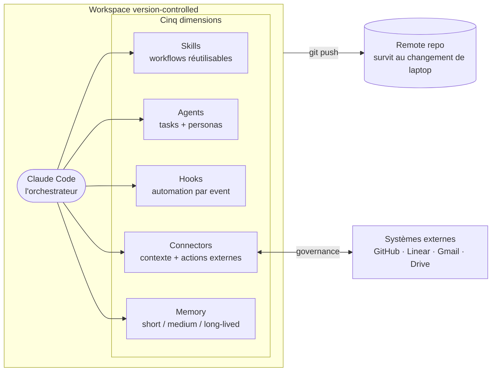

import LeadMagnet from '@/components/LeadMagnet.astro';

## Contexte

C'est la compagne pratique de *[Le harness derrière l'agent](/fr/writing/harness-behind-the-agent)*. Cette pièce-là explique pourquoi le harness est là où se compose l'effet de levier de l'opérateur. Celle-ci montre à quoi ressemble le mien — l'arborescence, le diagramme, les vrais noms des skills et personas que j'utilise, et l'ordre dans lequel je le construirais si je repartais de zéro.

Rien ici n'est théorique. Chaque artifact de cette pièce est dans le repo qui livre ce site. Vous lisez sa production en ce moment.

---

## Le modèle orchestrateur

La manière la plus simple de voir un harness, c'est comme un orchestrateur. Le modèle est le cerveau. Tout le reste est une dimension que le cerveau peut solliciter quand il en a besoin.



Un cerveau. Cinq dimensions. Un substrat — git — qui tient tout et qui fait que l'ensemble survit à une machine fraîche. C'est toute l'architecture.

---

## L'arborescence du workspace

Je garde un projet parent qui contient tout le reste en sub-projects ou en submodules. Ça me donne un seul `cd` au départ, un seul repo à cloner, et des boundaries propres au niveau projet pour tout ce que je veux scoper serré.

Forme :

```
Workspace/
├── CLAUDE.md                         ← instructions workspace-level
├── WORKSPACE_MAP.md                  ← « où est quoi », à lire en premier
├── .claude/
│   ├── settings.json                 ← permissions + hooks + config MCP
│   ├── setup.sh                      ← bootstrap machine fraîche en une ligne
│   ├── hooks/                        ← scripts event-triggered
│   │   ├── session-start.sh
│   │   ├── block-protected-push.sh
│   │   └── auto-commit.sh
│   ├── git-hooks/
│   │   └── pre-push                  ← workspace npm audit gate
│   ├── agents/                       ← mes trois personas
│   │   ├── gtm-strategist.md
│   │   ├── principal-engineer.md
│   │   └── career-coach.md
│   ├── personal-skills/              ← skills workspace-wide
│   │   ├── commit/
│   │   ├── log-decision/
│   │   ├── wrap-session/
│   │   └── …
│   └── decisions/DECISIONS.md        ← decision log en append-only
├── memory/
│   ├── MEMORY.md                     ← index auto-chargé
│   └── feedback_*.md                 ← fichiers de memory opérationnelle
├── llm-context-2026/                 ← contexte stratégique long-lived
│   ├── inner-game/                   ← identité, hygiène de travail
│   ├── market/                       ← positioning, doctrine GTM
│   └── transition/                   ← contexte de phase
├── boringsystems/                    ← ce site, en submodule
│   ├── CLAUDE.md                     ← instructions project-level
│   └── .claude/skills/               ← skills project-level
└── <autres sub-projects>/
```

Deux propriétés de ce layout font un vrai travail. **Un** : chaque dimension a son propre dossier. Les skills ne sont pas à côté des hooks, la memory n'est pas à côté des decisions. On trouve ce qu'on cherche sans searcher. **Deux** : ce qui est spécifique à un projet vit dans le projet, pas à la racine du workspace. Un skill qui n'a de sens que pour ce site vit sous `boringsystems/.claude/skills/`, pas sous le `.claude/personal-skills/` partagé. Ça garde la couche partagée propre.

---

## Dimension 1 — Skills

J'ai une dizaine de skills à moi, plus ceux fournis par la plateforme de Claude Code. Ceux que j'invoque le plus :

- **`/commit`** — stage, écrit un commit message utile, push sur le feature branch en cours. Jamais sur `main`. Ferme le loop « je veux checkpointer ».
- **`/log-decision`** — append à `DECISIONS.md` avec date, contexte, décision, conséquences. Auto-invoqué après tout changement d'architecture que je veux pouvoir retrouver.
- **`/wrap-session`** — déclenché quand un PR a été mergé. Sync main, supprime le feature branch, propose des améliorations du harness à partir de ce qui est remonté dans la session. C'est le loop, codifié.
- **`/article-review`** — scopé à ce site. Charge mon design charter, mon doc target-audiences, mon guide FR, et flag les problèmes de voice / structure / lane avant publication.

Ce qui fait qu'un skill gagne sa place : un workflow que je fais au moins une fois par semaine, avec assez de structure répétable pour que la définition du skill soit plus courte que retaper les instructions. Si je l'ai écrit une fois et jamais utilisé, c'est un signal pour couper, pas pour garder.

Un fichier de skill, c'est court. Un titre, une description, un trigger, une checklist, un exemple. Pas de décoration.

---

## Dimension 2 — Personas

Je fais tourner trois personas. Chacune est un sub-agent avec un point de vue tranché, un budget d'outils, un set de documents pré-chargés avant de répondre, et une liste courte de situations où ça vaut le coup de les invoquer.

- **Naomi Renard — `gtm-strategist`.** Profil GTM senior, ancrage marché européen, craft de distribution. Lit mes docs de positioning et mon dossier go-to-market avant de répondre. Je l'invoque quand j'ai besoin de stress-tester un pitch, de façonner un narratif, de rebrand du past work, ou de décider si un inbound vaut le temps.
- **Daniel Kovac — `principal-engineer`.** Vingt-cinq ans across the stack, pragmatique-puriste, sceptique du hype. Lit mes docs de boundaries architecture avant de répondre. Je l'invoque pour les décisions d'architecture, la code review, les choix de stack, et quand j'ai besoin que quelqu'un me dise honnêtement si le shortcut est un shortcut ou un piège.
- **Hadi Bensoussan — `career-coach`.** Ancrage en psychologie des profondeurs, mentor technologue. Lit mes documents d'identité et de work hygiene. Je l'invoque quand je remarque que j'évite quelque chose, quand une décision porte plus de charge émotionnelle qu'elle ne devrait, ou quand j'ai besoin de structurer une pensée emmêlée avant un vrai mouvement.

Chaque fichier de persona suit la même structure : *qui c'est, quels outils il ou elle peut utiliser, quels documents pré-charger, quelles contraintes façonnent les réponses, et un set de situations nommées pour l'invocation.* Écrire une persona n'a rien de mystique. C'est un prompt avec de la discipline.

**Construire votre propre persona** se fait en trois passes. Première passe : la voix — qui c'est, quel background, quel registre, ce qu'il ou elle ne dit jamais. Deuxième passe : le pré-chargement — quels fichiers lire avant de répondre, pour que les réponses soient ancrées dans votre situation et pas génériques. Troisième passe : la liste d'invocation — quelles situations précises valent le coup de les tirer. Gardez cette liste courte. Une persona qu'on invoque pour tout arrête d'être une persona.

---

## Dimension 3 — Hooks

Les hooks, c'est le harness qui devient opinionated sans que j'aie à me souvenir de l'être. Ceux qui paient leur place sur mon workspace :

- **`SessionStart`** — charge les bons fichiers de contexte quand une session commence. Project-aware : la session workspace charge un contexte différent de la session à l'intérieur de ce site.
- **`PreToolUse` — block-protected-push.** Intercepte tout git push qui cible `main`, `master`, `dev`, `development`, ou `production` et le bloque. Je ne peux pas push sur un protected branch par accident. Le hook renvoie un message clair « utilise un feature branch ».
- **`Stop` — auto-commit.** Quand une session se termine avec des changements uncommitted sur un feature branch, le hook les commit avec un message de checkpoint et push. Le travail in-progress ne meurt jamais dans un terminal fermé.
- **`pre-push` (git-level) — npm audit gate.** Avant que n'importe quel push quitte ma machine, un script workspace-level lance `npm audit --audit-level=high` sur chaque sub-project. Si un seul a un finding high ou critical non résolu, le push est bloqué. Discipline de sécurité sans cérémonie.

Deux principes sur les hooks. Un — **les hooks enforce, ils ne rappellent pas.** Un hook qui dit « hé, tu voudrais peut-être faire X » est pire que pas de hook, parce qu'on arrête de le lire. Un hook agit, ou il dégage. Deux — **les hooks vivent dans le repo**. Un hook qui ne marche que sur mon laptop, parce que je l'ai configuré une fois et j'ai oublié, c'est un hook qui va échouer silencieusement quand je changerai de machine. Chaque hook de mon harness est committé.

---

## Dimension 4 — Connectors

Je suis strict sur une règle : **les connectors passent par la plateforme, jamais par des tokens sur disque.**

Concrètement : GitHub, Linear, Gmail, Google Calendar, Google Drive, Notion passent tous par le système de connectors claude.ai. Pas de personal access tokens dans des fichiers de config. Pas de clés API qui voyagent avec moi entre machines. L'agent demande une auth one-shot, la plateforme tient la session, et quand je change de laptop la connexion se ré-authentifie sans toucher à mes dotfiles.

La couche governance est posée au-dessus. Pour chaque connector, je décide quels verbes sont autorisés sans confirmation. Les operations read sont en général OK. Les operations write — envoyer un email, créer un Linear issue avec une due date qui va page quelqu'un, modifier un calendar — demandent une approbation explicite à chaque fois. Read-surtout / write-avec-confirmation, c'est le défaut raisonnable, et c'est ce que je fais tourner.

L'autre connector que j'utilise, c'est celui qui pointe vers ce repo — une intégration GitHub qui laisse l'agent ouvrir des branches pour moi mais ne le laisse jamais ouvrir des PRs. Je push ; j'ouvre le PR moi-même. Petite division du travail qui garde la passation propre et qui me donne un checkpoint naturel où je lis réellement le diff.

---

## Dimension 5 — Memory

Trois time-horizons, trois formes de fichiers sur disque.

**Short-lived — sessions.** Tasks, plans, state in-progress. Vit dans la memory de session de l'agent. Disparaît à la fermeture. Très bien.

**Medium-lived — memory opérationnelle.** Un dossier de petits fichiers markdown, un sujet par fichier. Chaque fichier capture un pattern que je veux persister à travers les sessions :

- une règle que l'agent doit suivre (`feedback_collaboration.md`)
- une réalité projet qui évolue chaque semaine (`project_boringsystems_lead_magnet.md`)
- un profil utilisateur qui façonne chaque session (`user_profile.md`)
- un pointeur vers du contexte externe (`reference_linear_boards.md`)

Tous indexés dans un fichier `MEMORY.md` en haut du dossier. Cet index est auto-chargé au session start. Les fichiers individuels sont chargés on demand quand le sujet remonte. Pas cher, borné, searchable.

**Long-lived — contexte stratégique.** Un dossier séparé (`llm-context-2026/` dans mon cas) qui tient les documents d'identité, la doctrine de positioning, la lentille de marché, les plans de transition. Ça évolue lentement — des semaines à des mois entre deux éditions significatives — et c'est load-bearing pour toute décision stratégique que l'agent m'aide à prendre. Je ne fusionne jamais ça dans la memory medium-lived. Mélanger les deux, c'est comme ça que le contexte stratégique se dilue dans le bruit du quotidien.

La théorie opérationnelle derrière ce split en trois couches, et pourquoi git dessous est non-négociable, est dans *[Context is the Edge](/fr/archive/s3-p2-context-is-the-edge)*.

---

## La matrice time-horizon

Séparer par time-horizon est le mouvement qui garde la charge cognitive sous contrôle. Chaque dimension a ses trois niveaux. En gros :

|  | Short-lived | Medium-lived | Long-lived |
|---|---|---|---|
| **Skills** | Prompts ad-hoc en session | Skills scopés au projet | Skills workspace-wide |
| **Agents** | Une sub-task déléguée | Une persona invoquée chaque semaine | Une persona qui façonne des mois de travail |
| **Hooks** | Un pre-check one-shot | Hooks de session et de commit | Hooks git-level + setup |
| **Connectors** | Une lecture one-shot | Intégrations touchées chaque semaine | Flux de contexte always-on |
| **Memory** | State de session | Memory de feedback opérationnelle | Archive de contexte stratégique |

La matrice n'est pas une checklist. C'est un diagnostic — quand quelque chose sent le chaos, je demande *cette chose appartient à quelle cellule, et est-ce que je la stocke dans la bonne ?* La moitié du temps la réponse, c'est que j'ai laissé quelque chose de short-lived fuiter dans de la memory long-lived, ou l'inverse, et nettoyer ça enlève la friction.

---

## Le loop

Chaque dimension s'améliore de la même manière.

1. L'agent fait quelque chose que je ne voulais pas, ou rate quelque chose dont j'avais besoin.
2. Je décide si c'était un one-off ou un pattern.
3. Si c'est un pattern, je choisis la dimension qui colle : un hook pour le bloquer, un skill pour le standardiser, une feedback memory pour l'enseigner, ou un ajustement de persona pour que la bonne lentille l'attrape la prochaine fois.
4. J'écris le changement dans le repo, je commit, je push.
5. La session suivante hérite de la leçon.

**Deux fois, c'est un pattern.** Si la même correction manuelle arrive deux fois dans une session, je m'arrête, je diagnostique, et je codifie avant la troisième. Cette règle à elle seule est responsable de la majorité du compounding que le harness livre.

L'autre moitié du loop, c'est le pruning. De temps en temps je lis le harness comme un étranger le lirait, skill par skill, hook par hook, fichier de memory par fichier de memory — et je demande *est-ce que j'ajouterais ça aujourd'hui ?* Si non, je coupe.

---

## Par où commencer, aujourd'hui

Une erreur que les opérateurs font quand ils voient un harness comme celui-ci, c'est d'essayer de le scaffolder en entier d'un coup. Ne faites pas ça. Le séquençage compte plus que la complétude.

1. **Faites du workspace un git repo.** Un seul projet parent. Tout vit dedans. C'est le substrat — sans ça, rien d'autre ne compose.
2. **Ajoutez un `CLAUDE.md` à la racine.** Une page. Qui vous êtes, comment vous voulez que l'agent travaille avec vous, les non-négociables.
3. **Écrivez un skill.** Le workflow que vous répétez le plus — probablement le commit, ou autre chose. Faites-en un slash command.
4. **Ajoutez un hook.** Celui qui vous protège de votre pire erreur. Pour la plupart des gens, bloquer les push vers `main` est le bon premier hook.
5. **Ajoutez un fichier de memory.** La correction que vous donnez le plus à l'agent. Écrivez-la dans un `feedback_*.md`. Indexez-la dans `MEMORY.md`.
6. **Ajoutez une persona.** La lentille dont vous auriez aimé avoir un humain de confiance. Gardez le fichier court, pré-chargez son contexte, définissez quand l'invoquer.
7. **Branchez un connector.** Le système externe qui tient le contexte dont l'agent a le plus souvent besoin. Commencez en read-only.

Ça, c'est un weekend de travail. Après, vous le faites grandir depuis le loop — depuis les erreurs et les patterns, pas depuis un plan. Laissez le harness vous dire ce dont il a besoin.

---

## Note de clôture

Les cinq dimensions sont une carte. Le substrat, c'est ce qui rend la carte réelle. Le loop, c'est ce qui fait que la carte s'améliore. C'est toute la chose.

Je fais tourner ça pour mon propre travail tous les jours. Ce n'est pas une démo et ce n'est pas complet — c'est un système vivant qui a grandi à partir d'une dizaine de semaines où je l'ai fait tourner sérieusement. La version que je ferai tourner en octobre ne ressemblera pas à celle-ci. C'est le point.

Si vous voulez la version doctrine de cette pièce — le *pourquoi*, les contre-positions, la fenêtre de platformization — c'est *[Le harness derrière l'agent](/fr/writing/harness-behind-the-agent)*.

Si vous avez déjà un harness en place et que vous voulez une deuxième paire d'yeux dessus, c'est le lead magnet ci-dessous — je vous renvoie un audit écrit plus un set de prompts que votre coding agent peut lancer pour le faire évoluer. Si vous partez de zéro et que vous voulez le scaffolding complet de stack — celui qui configure git, GitHub, Vercel, Neon, Resend, et les conventions de départ — l'[AI-Native Builder Starter Prompt](/fr/writing/solo-founder-new-baseline) est le meilleur point d'entrée.

Choisissez celui qui colle à où vous en êtes. Le harness est à vous à construire, dans les deux cas.

<LeadMagnet
  assetSlug="harness-audit"
  lang="fr"
  articleTitle="Le harness que je fais tourner"
  articleUrl="https://boringsystems.app/fr/building/the-harness-i-actually-run"
/>
