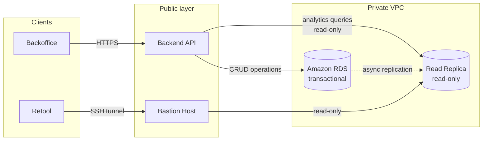

## Context

After the platform had been reclaimed from vendor dependency and hardened for enterprise readiness, the next demand was predictable: enterprise customers needed to see data about their operations.

Not raw exports. Not a separate BI tool standing outside the product. Credible KPI visibility inside the backoffice dashboard they already used — scoped to their tenant, behind the same RBAC as the rest of the platform.

The question was not whether to build it. It was what form to take, at what cost to the production system, and with what commitment to infrastructure given the absence of a dedicated contributor to build or maintain it.

---

## Constraint Pattern

The environment at that point carried a specific set of constraints:

- no dedicated data engineer,
- no DevOps capacity for new infrastructure surfaces,
- a production Amazon RDS indexed and partitioned for transactional load — not analytics queries,
- engineering capacity stretched across platform delivery,
- and a business still in early stage — the KPI vocabulary needed to help customers buy and evaluate the platform, not support full operational intelligence.

Adding a data warehouse, a modelling layer, and ETL pipelines was not the answer. Neither was accepting indefinitely that analytics queries would run against the production database.

---

## Objective

Deliver tenant-scoped KPI visibility inside the existing backoffice dashboard — without adding new risk to the production database, without overcommitting to infrastructure that had no dedicated contributor to build or maintain it, and without creating a migration problem if the right infrastructure arrived later.

---

## Execution Overview

### Phase 1 — Build the Surface, Accept the Temporary Risk

The first step was to expose analytics at all.

A dedicated backend analytics module was built. It served two endpoint classes: a booking summary (counts and aggregates over a two-month rolling window) and a booking comparison (current month against previous month). No slice-and-dice. No aggregation builder. No exports, no scheduler, no scheduled reports.

The KPI surface was deliberately narrow — only what an enterprise customer needed to evaluate the platform as a buyer and to operate it effectively. Deeper analytics belong in a different tool, on different infrastructure, owned by a different function.

At this phase, the module read from the primary Amazon RDS. That was a temporary compromise, not a target state. The queries were simple and parameterized. The database was indexed for operational use and, coincidentally, well-suited to answering these bounded queries.

---

### Phase 2 — Isolate the Traffic: Read Replica on Amazon RDS

The risk of analytics reads hitting the primary Amazon RDS had a fix that required no application code change.

A read replica was provisioned via Terraform, present only in high-availability environments. A dedicated read-only database user was created. The replica became the single analytics target for all consumers: the backend analytics module, [Retool](https://retool.com), and direct database connections used for operational reporting.

The replica is asynchronous. Lag is acceptable for monthly aggregates and is documented in the runbook. The replica's role is not real-time visibility — it is to absorb analytics read traffic without touching the primary.

---

### Phase 3 — Wire the Isolation: Named DataSource, Read-Only by Construction

The analytics module was wired to a dedicated TypeORM DataSource — named `analytics`, registered separately from the primary DataSource. Configured with `synchronize: false`, `migrationsRun: false`, and no entity registration. No write operation is expressible through the framework against it. Read-only is a structural constraint, not a policy.

Queries run as parameterized raw SQL. No ORM entity references. No cross-DataSource joins. Tenant scoping is applied through the same mechanism as the primary DataSource: the same tenant pool hook sets the correct `search_path` from the CLS context on every connection acquire, validated against the tenant allowlist. One tenancy model across the API — analytics queries are not exempt.

Credentials are managed in AWS Secrets Manager — `{username, password, host, port, dbname}` — loaded at boot through the same pattern as primary database credentials. The backend has no opinion on what is behind the analytics secret. Each environment configures its own. A missing or malformed secret fails loudly at boot; no silent fallback.

The resulting topology, once Phase 3 is complete:

---

### Phase 4 — The Swap Path: Built In From Day One

The deliberate decision in this architecture was not the read replica. It was the secret boundary.

The analytics DataSource does not know whether its target is an Amazon RDS replica or a purpose-built analytics database. It reads a secret. It connects. It runs queries.

When the business reaches the trigger — a data engineering hire, a KPI surface that outgrows raw SQL, a team that can own a warehouse and a modelling layer — the migration is:

- update the analytics secret content in AWS Secrets Manager,
- restart the application,
- replace raw SQL queries with calls against the prepared schema.

No deployment. No code migration. No disruption to tenancy behavior, RBAC, or the backoffice dashboard. What changes is behind the secret.

The cost deliberately deferred — and that should stay deferred until the trigger is real — is building the analytics database: schema design, modelling layer, pipelines, ownership. That programme of work belongs to the moment when a data engineering function exists to own it. Introducing it earlier, without that function, repeats the same mistake as the earlier dbt experiment: infrastructure built ahead of the team's capacity to use it.

---

## Result

Analytics traffic is physically isolated from the production database. Enterprise customers have KPI visibility inside the backoffice dashboard, scoped to their tenant, protected by the same RBAC as the rest of the platform.

The operational outcomes were:

- analytics requests no longer touch the primary Amazon RDS in any environment where the analytics secret is populated,
- the same replica serves the backend dashboard, Retool, and direct database connections — one target, multiple consumers,
- the swap path to a dedicated analytics database costs nothing in application code — a secret change and an application restart,
- and the KPI surface is narrow enough that it does not distort the production system's indexing or query planner behavior.

The key outcome was not a dashboard. It was the decision not to overcommit.

---

## Closing Note

This case illustrates that analytics at an early stage is less an infrastructure problem than a sequencing problem. The right infrastructure at the wrong moment — before a function exists to own it, before the KPI vocabulary has stabilized — creates surface and cost without value. The right infrastructure at the right moment costs almost nothing to adopt.

The data isolation path described here is one layer of the broader platform hardening programme documented in [Hardening a Live Platform for Enterprise Readiness](/en/work/saas-hardening/). The vendor lock-in context that preceded it — and the first dbt experiment — is documented in [Reclaiming System Ownership Under Vendor Lock-In](/en/work/breaking-vendor-lock-in/). The architectural boundaries governing this surface — production data integrity, read-only construction, tenant scoping — are maintained under the governance model described in [Establishing Cross-Surface Architecture Governance](/en/work/architecture-governance/). A parallel hardening case — auth layer boundary separation — is documented in [Untangling Auth Layer Boundaries in a Running System](/en/work/untangling-auth-layer-boundaries-in-a-running-system/).

This work was executed at [Enakl](https://enakl.com) — a VC-backed B2B/B2G mobility platform serving emerging markets.

---

## An Earlier Experiment

Before the current architecture, there was a first attempt worth indexing here.

During the vendor lock-in phase, the external provider made data available as weekly exports to Google Drive. A [dbt](https://www.getdbt.com) project ran scheduled jobs on GitHub Actions runners, transformed the export into a minimal data model, wrote results back to Google Drive, and fed a basic reporting surface in Google Data Studio. Free. Fully automated. Technically coherent.

It ran correctly for months and barely moved anything.

The lesson was not that the tooling was wrong. It was that analytics infrastructure without a function to own, interpret, and route it into decisions creates maintenance surface without value. The pipeline ran. Nobody noticed when it did, and nobody noticed when attention moved elsewhere.

When internal platform ownership was established, Retool replaced that layer for internal ad-hoc needs — direct connection to the same data source, export and drill-down workflows that internal teams actually used, without the overhead of a pipeline nobody owned.

The principle extracted: analytics tooling should scale forward, not backward. Introduce it when the function exists to own it — not when the engineering capacity exists to build it.
