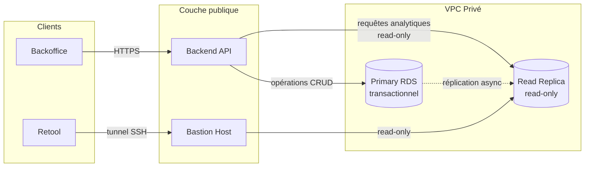

## Contexte

Après que la plateforme ait été internalisée et durcie pour les cas d'usage enterprise, la demande suivante était prévisible : les clients enterprise avaient besoin de voir leurs données opérationnelles.

Pas des exports bruts. Pas un outil BI externe au produit. Une visibilité KPI crédible dans le backoffice qu'ils utilisaient déjà — scopée à leur tenant, derrière le même RBAC que le reste de la plateforme.

La question n'était pas de savoir s'il fallait construire quelque chose. C'était quelle forme adopter, à quel coût pour le système de production, et avec quel engagement vis-à-vis d'une infrastructure en l'absence de contributeur dédié pour la construire ou la maintenir.

---

## Contraintes

L'environnement portait à ce moment-là un ensemble de contraintes spécifiques :

- aucun data engineer dédié,
- pas de capacité DevOps disponible pour de nouvelles surfaces d'infrastructure,
- un RDS* de production indexé et partitionné pour la charge transactionnelle — pas pour des requêtes analytiques,
- une capacité engineering mobilisée sur la livraison produit,
- et un business encore en phase précoce — le vocabulaire KPI devait aider les clients à évaluer et utiliser la plateforme, pas supporter une intelligence opérationnelle complète.

Ajouter un data warehouse, une couche de modélisation et des pipelines ETL n'était pas la réponse. Accepter indéfiniment que les requêtes analytiques frappent la base de production non plus.

---

## Objectif

Livrer une visibilité KPI scopée par tenant dans le backoffice existant — sans ajouter de risque à la base de production, sans s'engager sur une infrastructure en l'absence de contributeur dédié pour la construire ou la maintenir, et sans créer un problème de migration si la bonne infrastructure devait arriver plus tard.

---

## Exécution

### Phase 1 — Exposer la surface, accepter le risque temporaire

La première étape était d'exposer une analytics quelle qu'elle soit.

Un module backend analytics dédié a été construit. Il servait deux classes d'endpoints : un booking summary (comptages et agrégats sur une fenêtre glissante de deux mois) et un booking comparison (mois courant par rapport au mois précédent). Pas de slice-and-dice. Pas de builder d'agrégation. Pas d'export, pas de scheduler.

La surface KPI était délibérément limitée — uniquement ce qu'un client enterprise avait besoin pour évaluer la plateforme en acheteur et l'opérer efficacement. Les analytics plus profondes appartiennent à un autre outil, sur une autre infrastructure, détenu par une autre fonction.

À cette phase, le module lisait depuis le RDS primaire. C'était un compromis temporaire, pas un état cible. Les requêtes étaient simples et paramétrées. La base était indexée pour l'usage opérationnel et, par coincidence, bien adaptée à ces requêtes délimitées.

---

### Phase 2 — Isoler le trafic : read replica sur RDS

Le risque des lectures analytiques frappant le RDS primaire avait un correctif qui ne nécessitait aucun changement de code applicatif.

Un read replica a été provisionné via Terraform*, présent uniquement dans les environnements haute disponibilité. Un utilisateur de base de données read-only dédié a été créé. Le replica est devenu la cible analytique unique pour tous les consommateurs : le module backend analytics, Retool*, et les connexions directes à la base utilisées pour le reporting opérationnel.

Le replica est asynchrone. Le lag est acceptable pour des agrégats mensuels — documenté dans le runbook. Le rôle du replica n'est pas la visibilité temps réel : c'est d'absorber le trafic de lectures analytiques sans toucher la base primaire.

---

### Phase 3 — Câbler l'isolation : DataSource nommée, read-only par construction

Le module analytics a été câblé sur une DataSource TypeORM* dédiée — nommée `analytics`, enregistrée séparément de la DataSource primaire. Configurée avec `synchronize: false`, `migrationsRun: false`, et aucune entity enregistrée. Aucune opération d'écriture n'est exprimable via le framework contre elle. Le read-only est une contrainte structurelle, pas une politique.

Les requêtes tournent en raw SQL paramétré. Pas de références aux entities ORM. Pas de joins cross-DataSource. Le tenant scoping est appliqué via le même mécanisme que la DataSource primaire : le même tenant pool hook positionne le bon `search_path` depuis le contexte CLS* à chaque acquisition de connexion, validé contre la allowlist de tenants. Un seul modèle de tenancy à travers l'API — les requêtes analytiques n'y font pas exception.

Les credentials sont gérés dans AWS Secrets Manager* — `{username, password, host, port, dbname}` — chargés au démarrage selon le même pattern que les credentials de la base primaire. Le backend n'a pas d'opinion sur ce qui se trouve derrière le secret analytics. Chaque environnement configure le sien. Un secret manquant ou malformé fait échouer bruyamment au démarrage ; pas de fallback silencieux.

La topologie résultante, une fois la Phase 3 complète :

---

### Phase 4 — Le chemin de migration : prévu dès le premier jour

La décision délibérée dans cette architecture n'était pas le read replica. C'était la frontière du secret.

La DataSource analytics ne sait pas si sa cible est un replica RDS ou une base de données analytique dédiée. Elle lit un secret. Elle se connecte. Elle exécute des requêtes.

Quand le business atteint le déclencheur — un recrutement data engineering, une surface KPI qui dépasse le raw SQL, une équipe capable de prendre en charge un warehouse et une couche de modélisation — la migration se résume à :

- mettre à jour le contenu du secret analytics dans AWS Secrets Manager,
- redémarrer l'application,
- remplacer les requêtes raw SQL par des appels contre le schéma préparé.

Pas de déploiement. Pas de migration de code. Pas de perturbation du comportement de tenancy, du RBAC, ni du backoffice. Ce qui change est derrière le secret.

Le coût délibérément différé — et qui devrait le rester jusqu'à ce que le déclencheur soit réel — est la construction de la base analytique : conception du schéma, couche de modélisation, pipelines, propriété. Ce programme de travail appartient au moment où une fonction data engineering existe pour le prendre en charge. L'introduire plus tôt, sans cette fonction, reproduit la même erreur que l'expérience dbt précoce : de l'infrastructure construite avant que l'équipe ait la capacité de l'utiliser.

---

## Résultat

Le trafic analytique est physiquement isolé de la base de production. Les clients enterprise ont une visibilité KPI dans le backoffice, scopée à leur tenant, protégée par le même RBAC que le reste de la plateforme.

Les outcomes opérationnels :

- les requêtes analytiques ne touchent plus le RDS primaire dans aucun environnement où le secret analytics est correctement renseigné,
- le même replica sert le dashboard backend, Retool, et les connexions directes à la base — une cible unique, plusieurs consommateurs,
- le chemin de migration vers une base analytique dédiée ne coûte rien en code applicatif — un changement de secret et un redémarrage d'application,
- et la surface KPI est suffisamment limitée pour ne pas perturber l'indexation ou le comportement du query planner de la base de production.

Le résultat clé n'était pas un dashboard. C'était la décision de ne pas s'engager prématurément.

---

## Note de clôture

Ce cas illustre que l'analytics en phase précoce est moins un problème d'infrastructure qu'un problème de séquençage. La bonne infrastructure au mauvais moment — avant qu'une fonction existe pour la prendre en charge, avant que le vocabulaire KPI se soit stabilisé — crée de la surface et du coût sans valeur. La bonne infrastructure au bon moment demande presque rien pour être adoptée.

Le chemin d'isolation des données décrit ici est l'une des couches du programme de hardening documenté dans [Renforcer une plateforme en production pour l'entreprise](/fr/work/saas-hardening/). Le contexte de vendor lock-in qui l'a précédé — et la première expérience dbt — est documenté dans [Reprendre la maîtrise du système face au verrouillage fournisseur](/fr/work/breaking-vendor-lock-in/). Les frontières architecturales qui gouvernent cette surface — intégrité des données de production, construction read-only, tenant scoping — sont maintenues sous le modèle de gouvernance décrit dans [Établir une gouvernance d'architecture transversale](/fr/work/architecture-governance/). Un cas de hardening parallèle — la séparation des frontières de couche d'authentification — est documenté dans [Délimiter les couches d'authentification dans un système en production](/fr/work/untangling-auth-layer-boundaries-in-a-running-system/).

Ce travail a été réalisé chez [Enakl](https://enakl.com) — une plateforme B2B/B2G de mobilité en marchés émergents, soutenue par des VCs.

---

## Une expérience précoce

Avant l'architecture actuelle, il y avait eu une première tentative — utile à indexer ici.

Pendant la phase de vendor lock-in, le prestataire externe rendait les données disponibles sous forme d'exports hebdomadaires vers Google Drive*. Un projet dbt* faisait tourner des jobs planifiés sur GitHub Actions*, transformait l'export en un data model minimal, réécrivait les résultats sur Google Drive, et alimentait un reporting basique dans Google Data Studio*. Gratuit. Entièrement automatisé. Techniquement cohérent.

Il a tourné correctement pendant des mois et n'a pratiquement rien produit.

La leçon n'était pas que l'outillage était mauvais. C'était que de l'infrastructure analytique sans une fonction pour la posséder, l'interpréter et l'intégrer aux décisions crée de la surface de maintenance sans valeur. Le pipeline tournait. Personne ne remarquait quand il le faisait, et personne ne remarquait quand l'attention se déplaçait ailleurs.

Quand la propriété interne de la plateforme a été établie, Retool a remplacé cette couche pour les besoins ad hoc internes — connexion directe à la même source de données, workflows d'export et de drill-down que les équipes internes utilisaient réellement, sans la charge d'un pipeline dont personne n'était responsable.

Le principe extrait : les outils analytiques doivent scaler vers l'avant, pas vers l'arrière. On les introduit quand la fonction existe pour les prendre en charge — pas quand la capacité engineering existe pour les construire.

---

**Outils référencés** — *RDS : Amazon Relational Database Service (base de données relationnelle managée). *Terraform : outil d'infrastructure-as-code. *Retool : plateforme de tooling interne (panels admin, dashboards). *TypeORM : ORM pour Node.js / TypeScript. *CLS : continuation-local storage — suivi de contexte async en Node.js. *AWS Secrets Manager : coffre-fort de secrets managé (credentials, connection strings). *Google Drive : stockage de fichiers cloud. *dbt : framework de transformation SQL. *GitHub Actions : plateforme CI/CD et automation cloud. *Google Data Studio : interface de reporting BI, rebaptisée Looker Studio.
